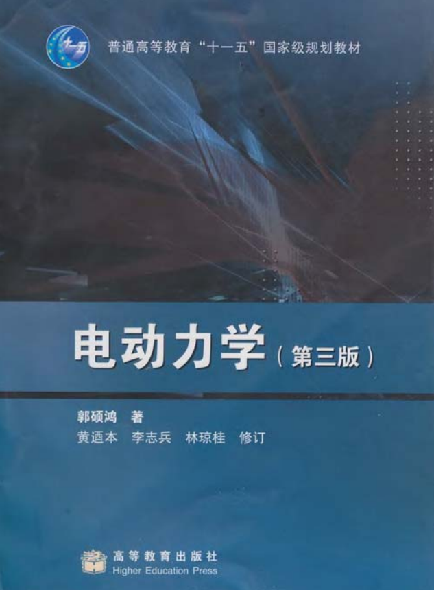
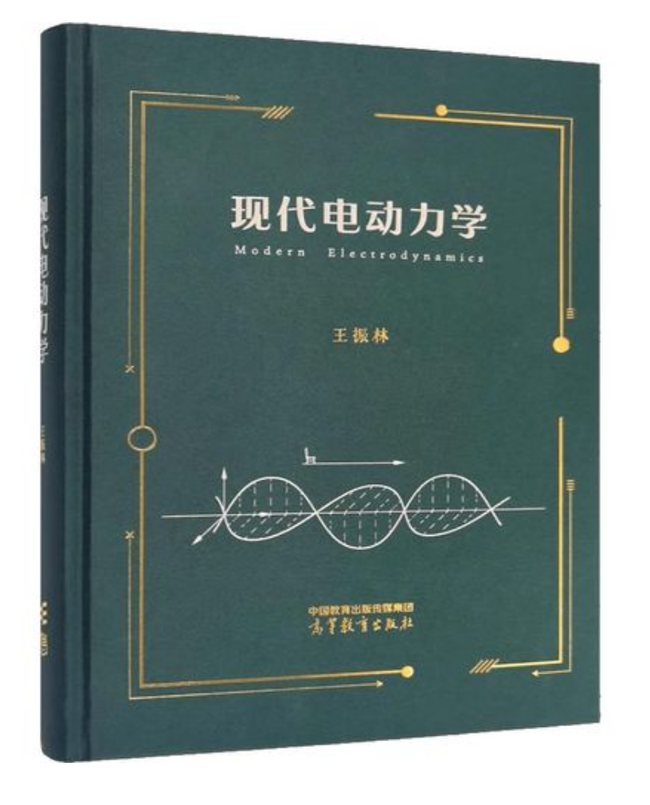
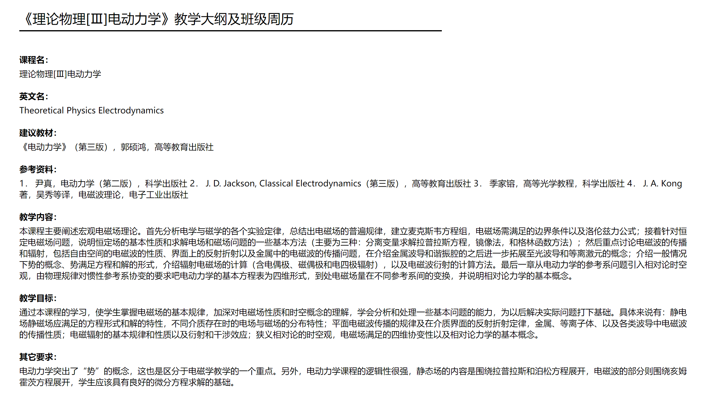

# fzk的课程学习

这只是一个测试文件

## 课程简介和引言

​	  电动力学是一门很难得课程，同学们学起来也是比较苦不堪言的，因此需要花费比较多得时间。

> Thus number may be said to rule the whole world of quantity, and the four rules of arithmetic may be regarded as the complete equipment of the mathematician.

## 使用教材

<strong>电动力学-郭硕鸿</strong>

<strong>现代电动力学-王振林</strong>

## 课程大纲

## 用于测试

	  先讨论TE模式
$$
\begin{cases}
E_x=E_z=H_y=0\\
\beta=k_x=k_1sin\theta=n_1k_0sin\theta\\
\nabla ×E=i\omega\mu H\\
\nabla×H=-i\omega\epsilon E\\
\end{cases}
$$
	  可以求得波动方程：
$$
\frac{\part^2 E_y}{\part z^2}+(\omega^2\mu\epsilon-\beta^2)E_y=\frac{\partial^2 E_y}{\partial z^2}+(k_0^2n_i^2-\beta^2)E_y=0
$$
	  定义介质和金属中的波数如下（均为非磁性）
$$
\begin{cases}
k_1^2=\beta^2-k_0^2\epsilon_1\\
k_2^2=\beta^2-k_0^2\epsilon_2\\
k_m^2=\beta^2-k_0^2\epsilon_m
\end{cases}
$$
	  解的形式如下：
$$
E_y=\begin{cases}
Be^{-k_2(z-d)}e^{i(\beta x-\omega t)}…………z>d\\
(A_1cosk_1z+A_2sink_1z)e^{i(\beta x-\omega t)}…0<z<d\\
0…………………………z<0
\end{cases}
$$
磁场分量可以由式$H_x=i\frac{1}{\omega \mu_o}\frac{\partial E_y}{\part z}$计算得到，补充$z=0和z=d$的边界条件有：$E_{1y}|_{z=0}=E_{my}|_{z=0}$、$E_{1y}|_{z=d}=E_{2y}|_{z=d}$、$H_{1x}|_{z=0}=H_{mx}|_{z=0}$、$H_{1x}|_{z=d}=H_{2x}|_{z=d}$。就可以求得对应的系数，对于TE模式，解得$A_1=A_2=0$,这是一个平凡的解，即不存在这样的模式。

|          | 频谱                                                         | 频谱密度                            |      |
| -------- | ------------------------------------------------------------ | ----------------------------------- | ---- |
| 能量信号 | $S(f)=\int^{\infty}_{-\infty}s(t)e^{-2\pi j\omega f}dt$      | $G(f)=|S(f)|^2$                     |      |
| 功率信号 | $C_n=\dfrac{1}{T_0}\int^{\frac{T_0}{2}}_{-\frac{T_0}{2}}s(t)e^{-j2\pi nf_0 t}dt$ | $P_n(f)=\sum|C(f)|^2\delta(f-nf_0)$ |      |